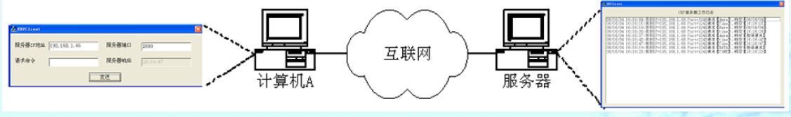
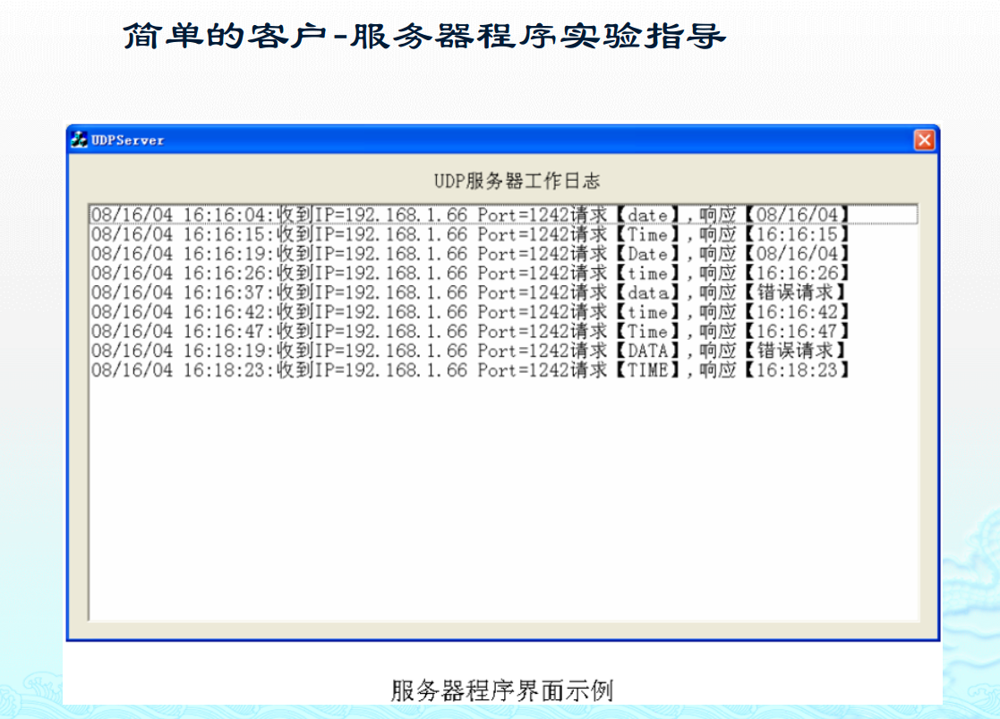
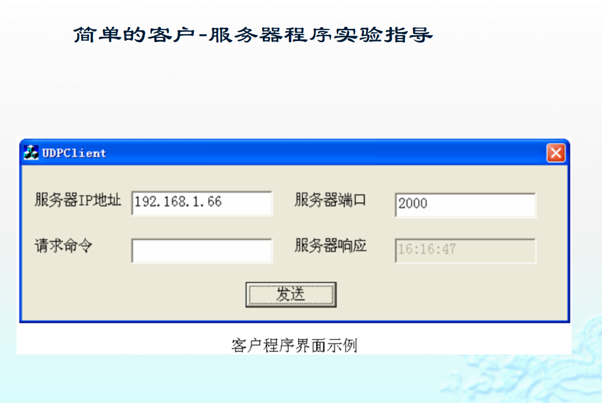
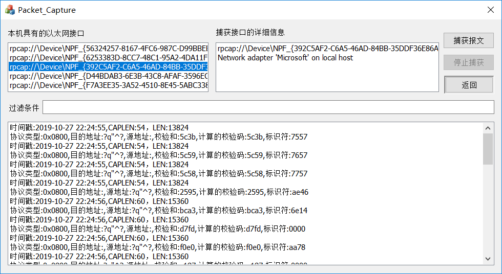
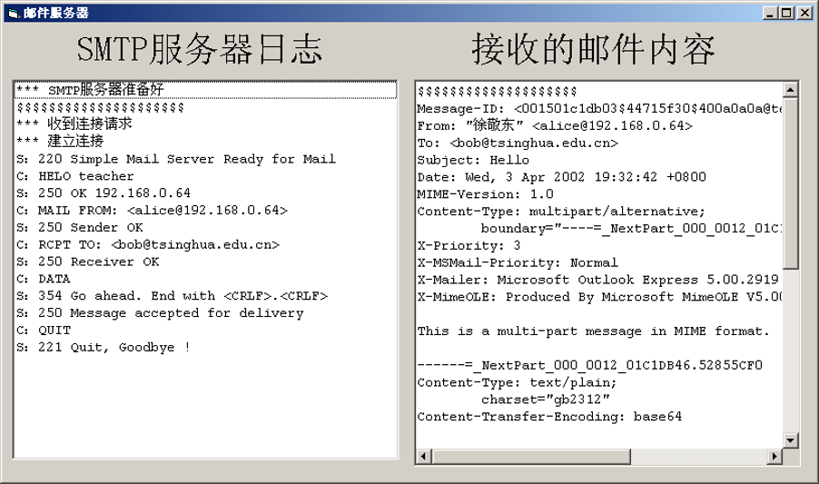
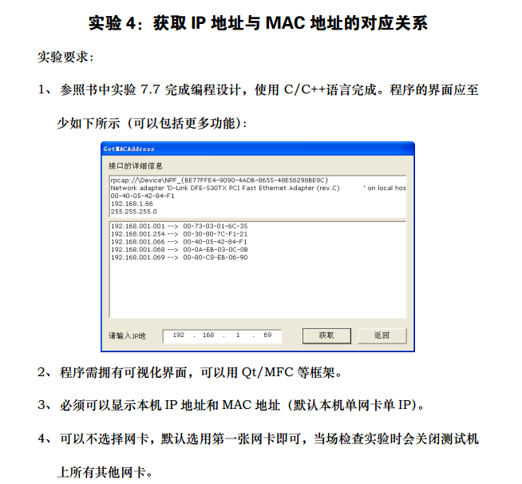

# computer-networks
> [jack-lio](https://github.com/Jack-Lio) 最新更新于2019年10月25日

## 实验一：客户-服务器程序
本实验要求通过编写程序实现客户端应用和服务器端应用的网络通信，利用`CAsyncSocket`类编写基于UDP协议的简单客户-服务器程序，服务器收到客户发来的“Time”或者“Date”请求后利用本地时间和日期分别进行响应。

服务器端的基本功能是显示工作日志，包括客户端的地址以及端口号以及请求命令类型，同时显示服务器端返回的结果是什么。

客户端的基本功能是选择输入服务器的IP地址和接收端口号，同时输入发送的命令，显示服务器返回的结果，在设定好命令和IP后点击发送给服务器端发送报文。

## 实验二：IP 数据包捕获程序
通过`WINPCAP`工具捕获网卡上的数据包并进行选择性的解析，并且能够像`wireshark`一样显示数据报相关信息。
- 实现界面大致如下所示：

## 实验三：SMTP邮件服务器
实现一个简单的SMTP邮件服务器，编写一个能够接收客户端的邮件并解析邮件内容进行显示的简单程序。大致界面如下图所示：

## 实验四：捕获ARP协议获取IP-MAC地址映射关系

## 实验五：简单路由程序，支持ping命令和Tracert命令

## 实验六：实现类似于FTP协议的文件传输协议

