# 实验一——套接字网络编程

> [jack-lio](https://github.com/Jack-Lio) 最新更新于2019年10月25日

## 一、 实验要求
本实验要求通过编写程序实现客户端应用和服务器端应用的网络通信，利用`CAsyncSocket`类编写基于UDP协议的简单客户-服务器程序，服务器收到客户发来的“Time”或者“Date”请求后利用本地时间和日期分别进行响应。

服务器端的基本功能是显示工作日志，包括客户端的地址以及端口号以及请求命令类型，同时显示服务器端返回的结果是什么。

客户端的基本功能是选择输入服务器的IP地址和接收端口号，同时输入发送的命令，显示服务器返回的结果，在设定好命令和IP后点击发送给服务器端发送报文。

## 二、实验环境说明
实验编译器环境为VS 2015，系统环境为windows 10 专业版，使用的核心库为`CAsyncSocket`套接字类。

## 三、程序功能设计
本客户-服务器端应用层协议分成两个部分，以下部分从客户端和服务器端分别进行功能说明和界面设计说明：

- 客户端：
  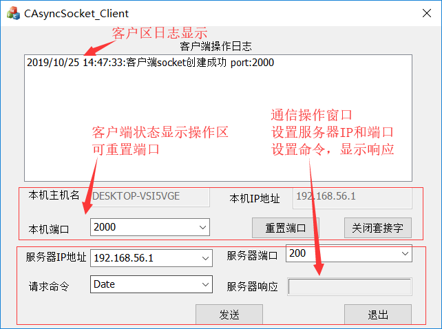
    - 功能设计:
        - 客户端可以向指定的IP地址和端口发送不区分大小写的字符串命令，当命令为“date”或者“time”，服务器端会返回服务器端的本地日期或时间，如果为其他命令，将返回“错误请求”的响应。
        - 客户端能够重新设置本机的套接字绑定端口，并且在本机IP地址栏能够显示本机IP地址，方便进行程序校验和完善程序体验。
        - 客户端日志窗口记录操作日志，对操作做出记录和反馈，完善程序功能。
  - 界面设计：
    - 程序打开界面如上图所示，主要分为三个区域——日志区、客户端状态显示区、操作区。
    - 所有命令输入栏均采用comb box 实现，能够在确定输入后记录历史输入，方便程序的实际操作。

- 服务器端：
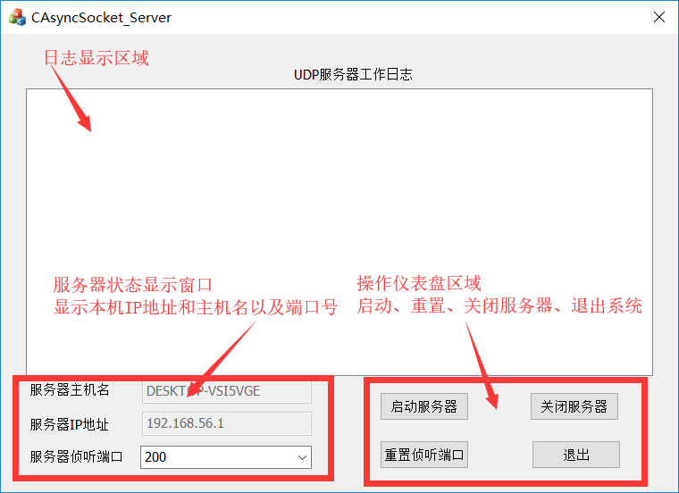
  - 功能设计：
    - 服务器端能够接收客户端发送的报文并进行解析，当命令为“date”或者“time”，服务器端会返回服务器端的本地日期或时间，如果为其他命令，将返回“错误请求”的响应。
    - 服务器端能够重新设置本机的套接字绑定端口，启动和关闭服务器端的服务，并且在本机IP地址栏能够显示本机IP地址，方便进行程序校验和完善程序体验。
    - 服务器日志窗口记录工作日志，对操作做出记录和反馈，完善程序功能。
  - 界面设计：
    - 程序界面主要分为三个区域——日志区、状态显示窗口、操作按钮区。
  
- 服务器-客户端网络通信应用层协议说明：

  - 请求响应过程说明：
	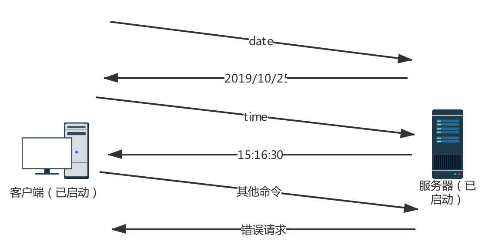
  - 超时重发示意图（本程序设置的超时时间为200ms，可在源代码中修改这一数值）：
  	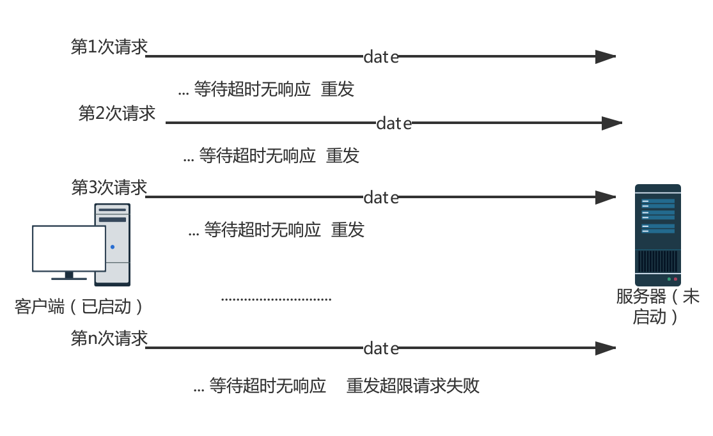

## 四、 实验实现功能效果 
- 发送接收基本功能程序演示：
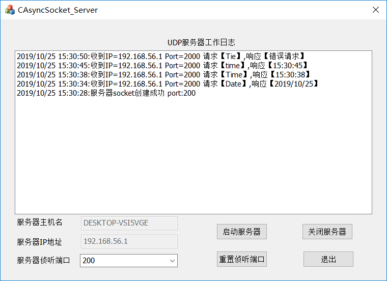
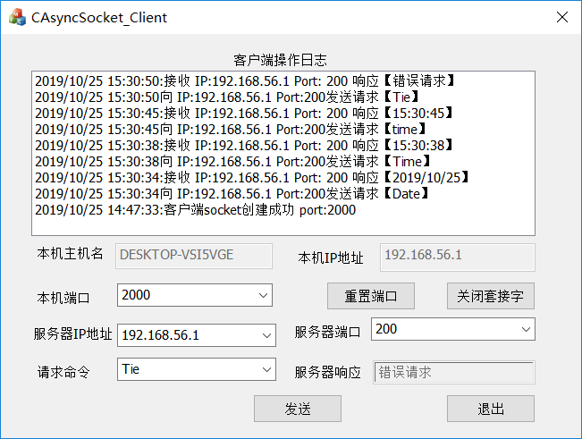
- 服务器端重置绑定端口演示：
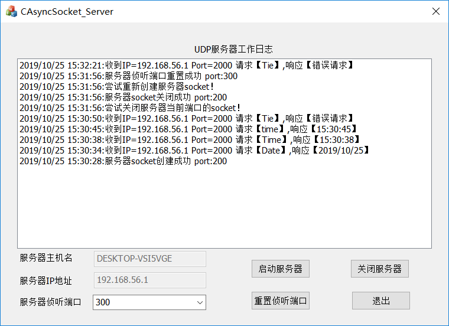
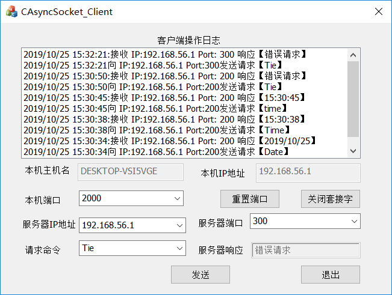
- 客户端重置绑定端口演示：
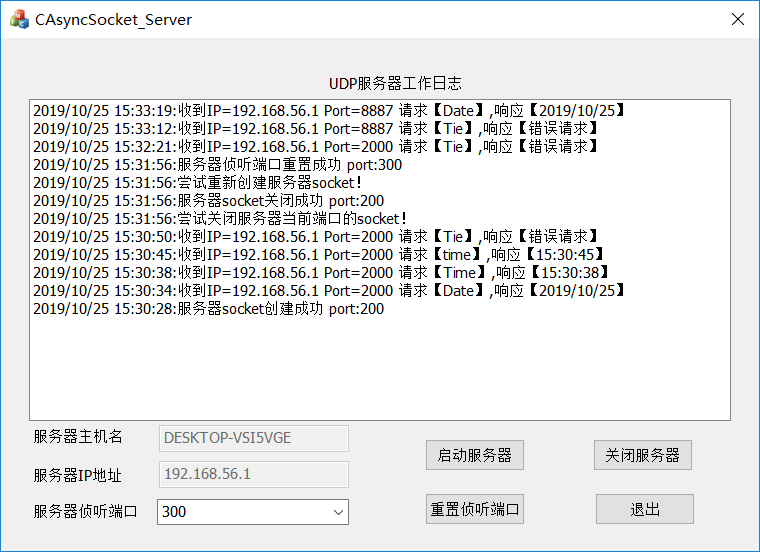
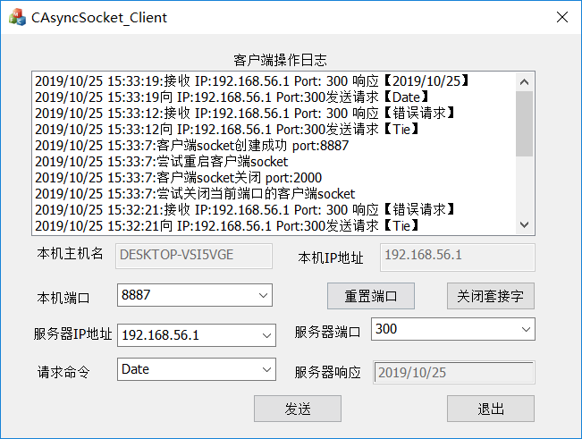
- 客户端超时重发演示：
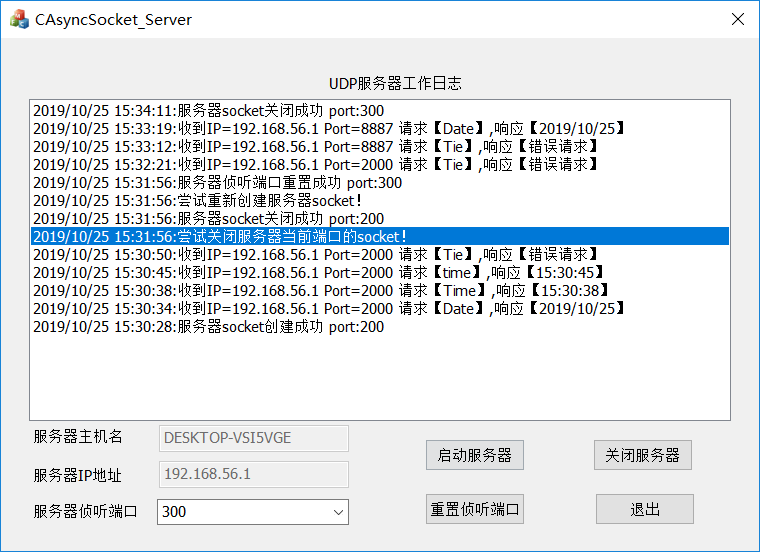
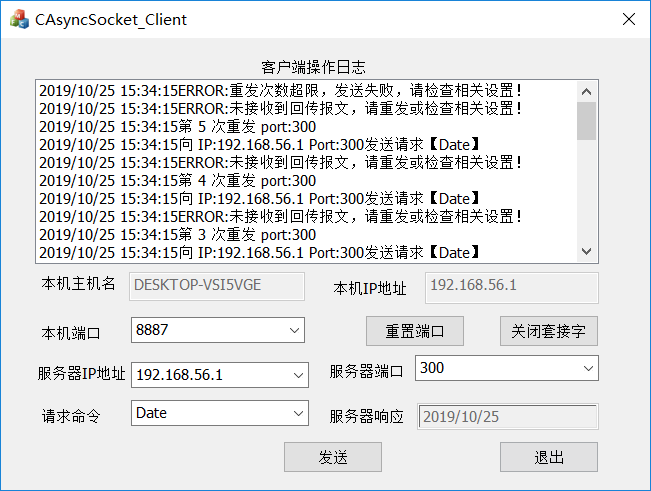
## 五、 其他说明
程序编写具体详情请参见源代码和注释