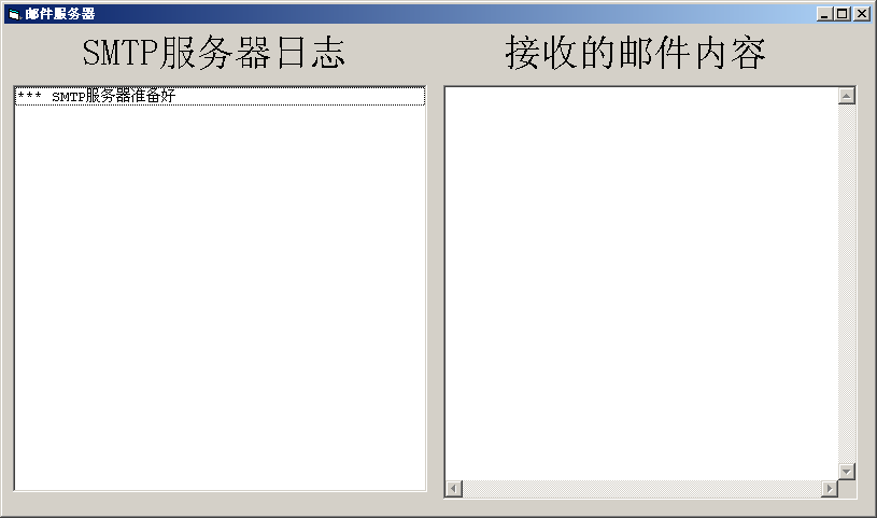

# 实验二    编写SMTP服务器并观察通信过程

## 一.  实验内容
1. 实验目的：
	​	观察电子邮件应用程序与SMTP邮件服务器的命令交互过程
	
2. 实验要求：简化的SMTP服务器
		- 响应客户的SMTP 命令，将命令的交互过程和收到的邮件显示到屏幕上
		- 支持单用户
		- 不保存和转发收到的邮件
		- 不做错误处理
3. 实验运行界面样例：

4. 发送接收效果样例：

